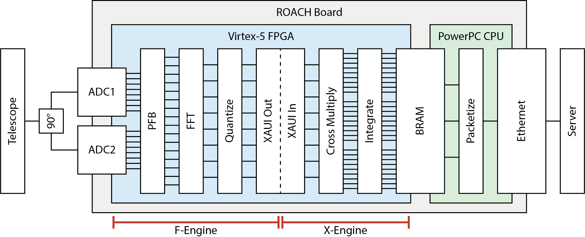
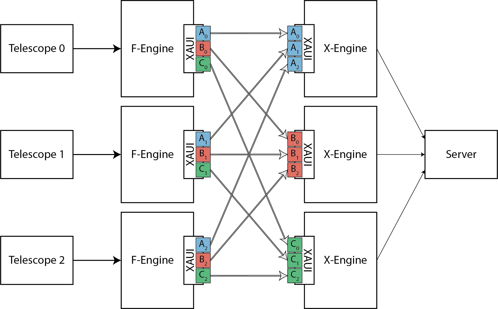

# System Architecture

**William Mallard** • 2009 – 2011

The ISI Digital Spectrometer/Correlator is a wideband FX correlator (Wishnow et al. 2010) for the three-telescope Infrared Spatial Interferometer (Hale et al. 2000) at Mount Wilson Observatory. It covers 2.88 GHz of bandwidth, split into 64 channels, with 4-bit quantization. The system is built from CASPER hardware: three ROACH boards with six 3 GSps ADCs, running synchronously at 360 MHz to process a combined 138 Gbps data stream.

**Note:** 360MHz was nearly double the speed of existing CASPER hardware in 2010; see [Performance Optimization](OPTIMIZATION.md) for how the design achieved timing closure.

## 1. Overview

In an **FX correlator** (Thompson et al. 2001), each **F-engine** channelizes one telescope's signal, and each **X-engine** cross-correlates a subset of channels across all telescopes.

For the ISI correlator, each ROACH board runs one F-engine and one X-engine, with the correlation workload divided evenly among the three boards. All boards run identical gateware: two ADCs, an F-engine, board interconnect logic, an X-engine, and network readout. The three boards are interlinked via synchronized 10 Gbps XAUI and connect to one central storage server via 1 Gbps Ethernet.

The ISI uses three movable telescopes to form three interferometric baselines, each sampling one point in the Fourier plane of the target star. The telescopes observe in the mid-infrared (~11 µm). Heterodyne receivers downconvert the signals to a radio-frequency IF band, which this system digitizes and cross-correlates. After collection, downstream analyses fit physical models to these correlation products, revealing the star's apparent angular size at each of 64 wavelengths.


***Figure 1.*** *Data flow through a single ROACH board, from telescope to server.*


***Figure 2.*** *Data flow across all three ROACH boards. Each F-engine distributes its channels (A, B, C) to the three X-engines via direct XAUI links.*

---

## 2. Digitization

Each ROACH has two ADCs that function together as a single 6 GSps digitizer. The ADCs also provide the FPGA clock and sync signals used by downstream subsystems.

### ADC Clocking

Each ROACH is connected to two 3 GSps ADC boards built around 8-bit National ADC083000 chips. All ADCs connect to a shared clock frequency generator operating at half the per-ADC sampling rate (up to 1.5 GHz); a quadrature splitter clocks each pair of ADCs 90° out of phase with respect to one another. A high-precision 1PPS signal is also fed to each board for synchronization.

For the ISI, each ADC is clocked at 1.44 GHz.

### Sampling

Each ADC samples on both the rising and falling edge of its clock signal, allowing it to sample at double the clock rate. By interleaving the two 90°-offset ADC data streams, each ADC pair produces an effective sampling rate of 4× the clock rate.

With a 1.44 GHz clock, this gives an effective sampling rate of 5.76 GSps, a Nyquist bandwidth of 2.88 GHz, and a data rate of ~46 Gbps per board.

### FPGA Clocking & Sync

The FPGAs are clocked by the ADCs at one-quarter of the ADC clock rate. With a 1.44 GHz ADC clock, the FPGAs run at 360 MHz. Between clock downsampling-by-four, ADC double-sampling, and ADC interleaving, each FPGA receives 16 ADC samples per clock cycle.

Each ADC board also passes through a 1PPS (one pulse per second) sync signal. The sync inputs are sampled once per ADC clock cycle, so each board produces four 1-bit sync samples per FPGA clock. These are used by the Synchronization subsystem to align the three boards.

---

## 3. Synchronization

The synchronization subsystem ensures all three ROACH boards process data in lockstep and marks integration boundaries.

Each board has a sync generator that produces a periodic pulse with a software-configurable period. This pulse defines integration boundaries and is used by most downstream blocks to coordinate their operation.

All three boards are clocked from a shared frequency generator, so once aligned they stay in lockstep with no drift. To align them, the user arms all three boards via control software. Each board then waits for the next 1PPS pulse and resets its sync generator and packetizer, ensuring all three begin their first integration on the same clock cycle.

Status bits—including the 1PPS signals and auxiliary inputs—are integrated over each sync period. If any bit goes high during the period, it stays latched until the next sync pulse, when the accumulated status is captured and included in output packets.

---

## 4. F-Engine

The F-engine transforms time-domain ADC samples into frequency-domain channels. It consists of a polyphase filter bank, an FFT, and a quantizer.

### Channelization

The F-engine splits the digitizer's full 2.88 GHz Nyquist bandwidth into 64 frequency channels (45 MHz each). The ISI's 2.7 GHz single-sideband IF band occupies the center 60 channels; the two channels at each band edge are outside the IF passband and can be discarded.

ADC samples are windowed with a polyphase filter bank, then passed through a 128-point streaming FFT. The parallel architecture processes 16 real inputs simultaneously, producing 8 complex outputs per clock. A full 64-channel spectrum is generated every 8 clock cycles (22 ns).

| Stage | Data Format |
|-------|-------------|
| ADC input | 16 × 8-bit real |
| FFT output | 8 × 36-bit complex (18r + 18i) |

The FFT produces ~103 Gbps.

### Quantization

The complex FFT values are quantized from 18 bits to 4 bits. To avoid bias in later integration stages, this is done via unbiased rounding and symmetric saturation.

Rounding towards 0 (or ±∞) would bias output magnitudes. Instead, values are rounded to the nearest even value, which alternates the rounding direction and preserves the average magnitude.

Since 4-bit signed values range from +7 to −8, the rounded values are saturated to ±7 to prevent a negative bias of −0.5.

The quantizer produces ~23 Gbps.

---

## 5. Board Interconnect

The board interconnect distributes F-engine output to the appropriate X-engines. Each F-engine sends 1/3 of its channels to each of the three X-engines (including its own). This requires packetizing data for XAUI transmission, transferring it between boards, and synchronizing the streams before they enter the X-engine.

### Pipeline Overview

Data moves through the interconnect in six stages:

```
clump → permuteF → XAUI → xaui_resync → permuteX → unclump
```

A data-aligned sync pulse travels in-band: `pre_xaui` concatenates it onto the data word before transmission, and `post_xaui` extracts it on the receive side.

### Clump

Each F-engine produces a full 64-channel spectrum every 8 clock cycles: 8 channels per clock, which doesn't divide evenly by 3. The `clump` block solves this by concatenating the 8 quantized channels (8 bits each) plus a zero-padded 9th dummy channel into three 24-bit output streams:

| Stream | Channels |
|--------|----------|
| A | [0, 1, 2] |
| B | [3, 4, 5] |
| C | [6, 7, pad] |

Each stream carries 3 channels per clock continuously.

### PermuteF (Shuffle)

The three clump outputs must be routed to the correct destinations: one stream stays on the local board (loopback to the local X-engine) and two are sent to the remote boards via XAUI. Which stream goes where depends on the board's `corr_id` register (0, 1, or 2).

The `permuteF` block uses three 4-input muxes, all selected by `corr_id`, to rotate the stream assignment:

| `corr_id` | Stream X<br>(loopback) | Stream Y<br>(XAUI 0) | Stream Z<br>(XAUI 1) |
|-----------|---------------------|--------------------|--------------------|
| 0 | A | B | C |
| 1 | B | C | A |
| 2 | C | A | B |

This is a left-rotation by `corr_id` positions. The effect is that stream X always carries the channel group assigned to the local X-engine, regardless of board identity.

### XAUI Transport

Each board pair is connected by a full-duplex 10 Gbps XAUI link. Each link carries one 24-bit stream at 360 MHz, giving a data rate of ~8.6 Gbps per link. Three blocks handle framing, transport, and the local loopback path:

**`pre_xaui`** (TX side) frames data for the XAUI transceiver. It concatenates the sync pulse onto the 24-bit data word (creating a 25-bit `tx_data`), sets `tx_oob` to zero and `tx_valid` to constant 1, and passes through `get` and `rst` signals from `xaui_resync` to control the receive FIFO. Three instances exist: `pre_loop` (loopback), `pre_xaui0` and `pre_xaui1` (remote links).

**`loopback`** emulates the XAUI interface for the local path using a 4K-entry Block RAM FIFO. It accepts the same framed `tx_data` as the XAUI transceivers and presents the same output port signature (`rx_data`, `rx_empty`, `tx_full`, etc.), so `xaui_resync` sees three identically-shaped streams regardless of whether data crossed a physical link. The loopback FIFO includes a configurable delay, tuned to approximately match the latency of the physical XAUI links.

**`post_xaui`** (RX side) unframes received data by slicing `rx_data` back into sync (bit 24) and data (bits [23:0]). All XAUI status signals (`rx_oob`, `rx_empty`, `rx_valid`, `rx_linkdown`) are terminated — flow control is handled entirely by `xaui_resync`.

### Xaui_resync (Stream Synchronization)

The `xaui_resync` block realigns the three incoming data streams (one loopback, two from XAUI links) so they can be processed in lockstep by the X-engine. It controls per-stream `get` signals that throttle reads from the upstream FIFOs (the XAUI transceivers' internal FIFOs and the loopback BRAM FIFO), offloading all buffering onto those existing FIFOs.

After an armed reset, each stream's `get` signal starts HIGH, flushing data from its upstream FIFO. When a stream's in-band sync pulse is detected, its `get` goes LOW, halting reads on that stream while the others continue draining. Once all three sync pulses have been detected, all FIFOs are paused for an additional 10 clock cycles (a configurable "buffer depth" parameter) to build up margin against link jitter. After this buffer period, all three `get` signals go HIGH simultaneously, resuming reads in lockstep, and the block emits a single unified sync pulse.

If the streams fall out of sync during operation (e.g., a sync pulse arrives on some streams but not all), the block resets and re-synchronizes.

### PermuteX (Unshuffle)

The `permuteX` block reverses the board-ID-dependent rotation applied by `permuteF`, using the same `corr_id` register. Its muxes apply a right-rotation by `corr_id` positions—the exact inverse of the left-rotation in `permuteF`. After unshuffling, all three boards see the streams in canonical order (A, B, C) regardless of board identity.

### Unclump

The `unclump` block is the inverse of `clump`: it slices each 24-bit stream into three 8-bit channels via bit extraction:

| Stream | Output channels | Bit ranges |
|--------|-----------------|------------|
| X | XA, XB, XC | [23:16], [15:8], [7:0] |
| Y | YA, YB, YC | [23:16], [15:8], [7:0] |
| Z | ZA, ZB, ZC | [23:16], [15:8], [7:0] |

This produces 9 output channels per clock (8 valid + 1 dummy from the zero-padded slot), which feed directly into the X-engine cross-multiplier.

---

## 6. X-Engine

The X-engine computes auto- and cross-correlation products. Each X-engine processes ~1/3 of the 64 channels, receiving an assigned subset from all three F-engines.

### Cross-Multiplication

Each X-engine receives 3 channels per clock from all three F-engines, and computes 9 correlation products per channel: 3 real auto-correlations (AA, BB, CC) and 3 complex cross-correlations (AB, BC, CA). With symmetric saturation (±7), each multiplier yields 8-bit products, for a total combined data rate of ~78 Gbps.

All three boards run identical gateware, with each processing 3 channels × 8 clocks = 24 channels per spectrum. Since 64 doesn't divide evenly by 3, one board receives only 2 valid channels per clock, with the third zero-padded. Channel assignments are determined by each board's `corr_id` register, which controls the stream permutation in the board interconnect stage.

### Integration

The X-engine integrates correlation products to increase SNR and reduce output data rate. It uses 32-bit vector accumulators (`vacc`), leaving 24 bits of headroom above the 8-bit products. With symmetric saturation (±7), the worst-case product magnitude is 98, so the accumulator can hold 2**31 / 98 ~ 21.9 million integrations before overflow.

Integration time is set by the user via the `sync_gen_period` register. With a full spectrum every 8 clock cycles at 360 MHz, products accumulate at 45 million spectra per second. The accumulator depth therefore limits the maximum integration time to ~487 ms, while the shared 1 Gbps Ethernet link sets the minimum to ~20 µs. The default is 1 ms, which gives a combined output data rate of ~18.4 Mbps.

---

## 7. Readout

The readout subsystem transfers integrated power spectra from the FPGA to the server for storage.

### Serialization

Each vector accumulator (`vacc`) serializes its 9 parallel correlation products into a 4 KB double-buffered BRAM (`vacc_[ABC]_bram`). An address counter writes channels sequentially into one half of the BRAM while the PowerPC reads the other. Each buffer half holds 360 values (5 integrations × 8 channels × 9 products × 4 bytes = 1440 bytes).

The address register (`vacc_[ABC]_addr`) exposes the FPGA's current write state to the PowerPC:

| Bits | Field | Description |
|------|-------|-------------|
| [31:10] | `pkt_id` | Integration counter (22 bits) |
| [9] | `bram_slot` | Buffer currently being written |
| [8:0] | `bram_addr` | Write position within buffer |

The PowerPC polls these registers to detect new data (via a change in `pkt_id`) and to locate the completed buffer (opposite of `bram_slot`).

### PowerPC Streaming

The `push_corr` firmware (C, cross-compiled for PowerPC) streams data from the FPGA to the control server. The ROACH's embedded Linux exposes FPGA BRAMs as files under `/proc`. On each integration cycle, `push_corr`:

1. Polls the address register for a new `pkt_id`
2. Reads all three vacc BRAMs and the `status` register from `/proc`
3. Re-reads the address register to verify `pkt_id` hasn't changed (discarding the read if it has)
4. Packs the data into UDP packets with header and status metadata
5. Sends the packets over 1 GbE to the control server

### Packet Format

Each UDP packet has an 8-byte header followed by correlation data:

| Field | Size | Description |
|-------|------|-------------|
| `board_id` | 1 byte | Board identity |
| `group_id` | 1 byte | Vacc identity (globally unique across boards) |
| (unused) | 2 bytes | — |
| `pkt_id` | 4 bytes | Integration counter |
| payload | 1460 bytes | Correlation data and status (32-bit signed) |

Each board sends 3 packets per integration cycle (one per vacc), with `group_id` computed as `3 × board_id + vacc_index`. Each packet carries 5 integrations of correlation data interleaved with status metadata (1460 bytes) — sized to fit within the Ethernet MTU.

### Server-Side Processing

The control server receives UDP streams from all three boards and synchronizes them by advancing each stream to a common `pkt_id` and `group_id`. Channels arrive out of frequency order due to the channel distribution in the board interconnect, so the server descrambles them before writing to disk in FITS format.

---

## 8. Summary of Data Rates

| Stage | Data Rate |
|-------|-----------|
| ADC input (per board) | ~46 Gbps |
| FFT output (per board) | ~103 Gbps |
| Quantizer output (per board) | ~23 Gbps |
| Interconnect (per link) | ~8.6 Gbps |
| Cross-multiplier output (per board) | ~78 Gbps |
| Integrator output (total, at 1 ms) | ~18.4 Mbps |

---

## 9. References

- Hale, D.D.S., et al. (2000). "The Berkeley Infrared Spatial Interferometer: A Heterodyne Stellar Interferometer for the Mid-Infrared." ApJ 537:998-1012.
- Thompson, A.R., et al. (2001). *Interferometry and Synthesis in Radio Astronomy.*
- Wishnow, E.H., et al. (2010). "Mid-infrared interferometry with high spectral resolution." Proc. SPIE 7734:773409.
