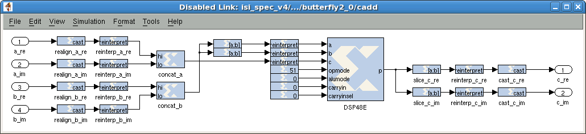
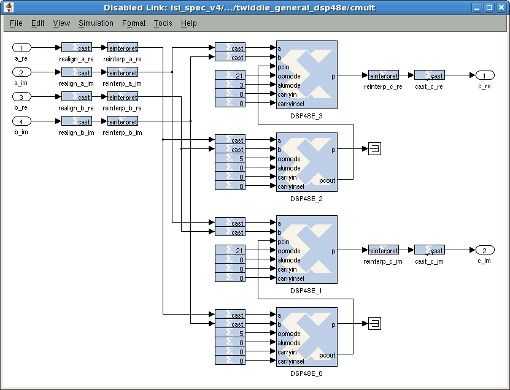
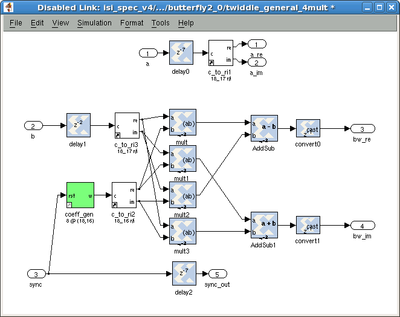
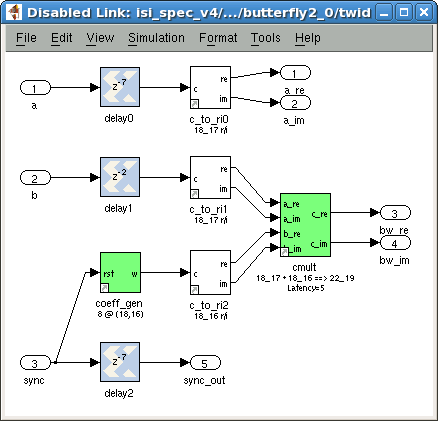
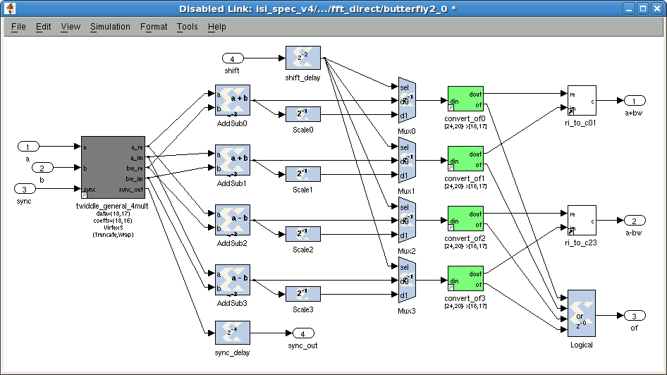
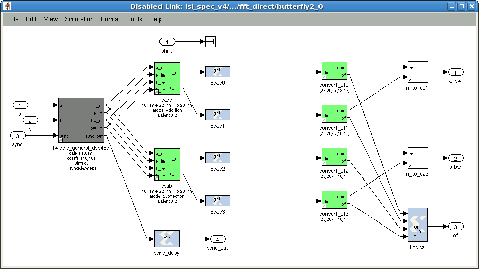
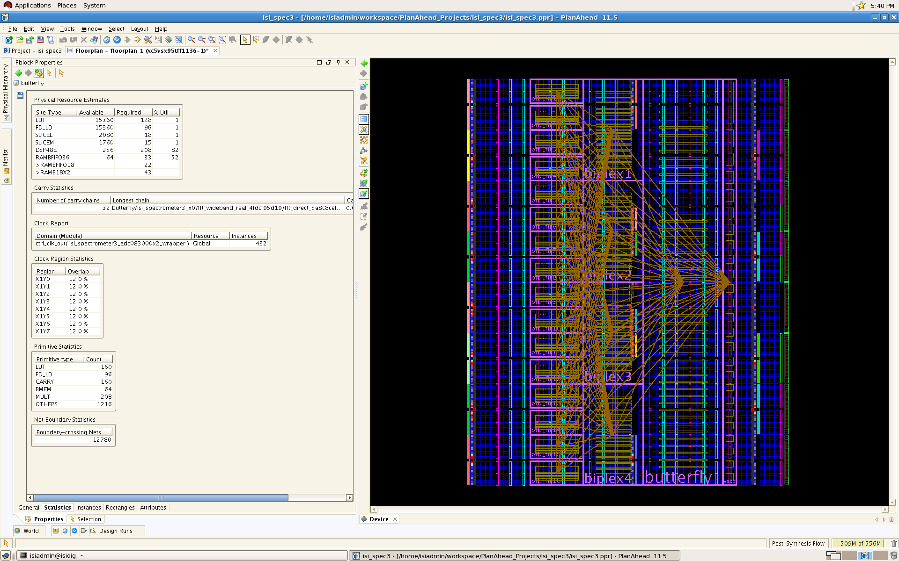

# FPGA Speed Optimization

**William Mallard** • 2009 – 2011

In 2009, I began building a [digital backend](ARCHITECTURE.md) for the Infrared Spatial Interferometer (ISI) at Mount Wilson Observatory. It needed to capture 2.88 GHz of bandwidth, which meant the FPGAs had to run at 360 MHz. At the time, the CASPER DSP library ([`mlib_devel`](https://github.com/casper-astro/mlib_devel/)) had only been used up to clock rates around 200 MHz. Closing this gap required three phases of optimization:

1. **DSP48E Primitives** — Creating new library blocks that map complex arithmetic onto Virtex-5 DSP48Es
2. **FFT Optimizations** — Integrating these blocks into the FFT, and fixing critical path bottlenecks
3. **Guided Floorplanning** — Constraining placement on the fabric to minimize routing delays

All of this work was contributed upstream to the CASPER `mlib_devel` library (see: [commit history](https://github.com/casper-astro/mlib_devel/commits?author=wjmallard)).

The floorplanning methodology was documented in [CASPER Memo #42: Speed Optimization with PlanAhead](https://casper.berkeley.edu/wiki/Speed_Optimization_with_PlanAhead).

---

## Phase 1: DSP48E Primitives (November – December 2010)

The Virtex-5 DSP48E is a hardened 25×18 multiply-accumulate unit with dedicated cascade routing between adjacent slices. By mapping complex arithmetic onto these primitives instead of fabric logic (LUTs/FFs), critical paths become shorter and more predictable.

| Block | DSP48Es | Description |
|-------|---------|-------------|
| `caddsub_dsp48e` | 1 | Complex add/subtract |
| `cmult_dsp48e` | 4 | Complex multiply |
| `power_dsp48e` | 2 | Complex power (magnitude-squared) |
| `dsp48e_bram_vacc` | 1 | Vector accumulator |

### Complex Add/Subtract (`caddsub_dsp48e`)

Packs {re, im} into the 48-bit datapath — one input to C, the other to A:B — and adds/subtracts both halves simultaneously. An unused bit at the half-boundary isolates the two components — preventing carry propagation from one into the other, but limiting inputs to 23 bits per component.

### Complex Multiply (`cmult_dsp48e`)

A complex multiply (a + bi)(c + di) = (ac − bd) + (ad + bc)i requires four real multiplies and two adds. Four DSP48Es form two pcout cascade chains: each chain computes one partial product and cascades it to a second slice that multiplies and accumulates. ALUMODE selects add vs. subtract for the real and imaginary paths. Inputs up to 25×18 bits (native DSP48E multiplier width). Supports conjugation by swapping ALUMODE assignments.

### Complex Power (`power_dsp48e`)

Computes complex magnitude-squared: |z|² = re² + im². One slice computes im², while the other computes re² and accumulates im² via pcout cascade, eliminating a fabric adder.

### Vector Accumulator (`dsp48e_bram_vacc`)

A BRAM-based vector accumulator where the DSP48E replaces both the fabric adder and mux. Data streams in on one port (DSP48E C), and the feedback path runs through a BRAM delay (DSP48E P → BRAM → DSP48E A:B). A `new_acc` pulse toggles OPMODE between accumulate (C + A:B) and load (C) to start a new integration, so no separate multiplexer is needed.

---

## Phase 2: FFT Integration (December 2010 – January 2011)

With the DSP48E primitives in hand, the next step was integrating them into the CASPER FFT library and fixing the timing violations that emerged.

### Integrated DSP48Es into FFT Twiddle

The twiddle multiplier (`twiddle_general_dsp48e`) wraps `cmult_dsp48e` to apply phase rotation coefficients to FFT data. Coefficients are stored in distributed ROM (low latency, saves BRAM), with an optional BRAM mode for large tables. The original CASPER implementation (`twiddle_general_4mult`) used four fabric multipliers and two adders. The optimized version explicitly instantiates 4 DSP48Es via `cmult_dsp48e`, instead of relying on Xilinx System Generator to infer them:

| Before | After |
|--------|-------|
|  |  |

### Integrated DSP48Es into FFT Butterfly

The butterfly combines the twiddle multiplier with complex add/subtract to form the core FFT operation. The rewrite of `butterfly_direct` to use `caddsub_dsp48e` for complex addition halved the DSP48E count compared to using full multiply-accumulate slices for add/subtract:

| Before | After |
|--------|-------|
|  |  |

### Integrated DSP48Es into FFT Unscrambler

The unscrambler required two new utility blocks before it could be rewritten.

- The `hilbert_dsp48e` block unscrambles bi-real FFT output, computing (a + b\*)/2 and (a − b\*)/2i. The original `hilbert` block used four fabric adder/subtractors. The optimized version uses two hardened DSP48Es — via `caddsub_dsp48e` blocks (one add, one subtract).
- The `delay_srl` block implements pipelined delays by splitting a delay into an explicit FF (1 cycle) followed by an SRL16 chain (remaining cycles). The FF's shorter setup time (~500 ps vs. ~1–2 ns for SRL16) relaxes the critical path into the delay element.

The `bi_real_unscr_4x` block was then rewritten using `hilbert_dsp48e` for the unscrambling operation, and `delay_srl` for short delays — replacing both the counter-based `sync_delay_ctr` and the BRAM-based `delay_bram`.

### Reduced FFT Wiring Complexity

Two features were added to reduce wiring congestion at high clock rates:

- **Hardcoded shift schedule** — Allows the FFT shift schedule to be fixed at compile time instead of routed as a runtime signal, reducing wiring complexity and resource consumption.
- **Optional output unscrambler** — Allows the channel unscrambler to be disabled entirely, deferring unscrambling to post-processing software.

### FFT Library Refactoring

- The `fft_wideband_real` init script was rewritten to draw blocks first and lines second, simplifying debugging when a block fails to draw.
- Library blocks were made empty by default (populated via `CopyFcn` callback on copy), which reduced Simulink `.mdl` library file size, and eliminated a class of Matlab segfaults during block redraw.

### Timing Bottleneck Fixes

At 360 MHz, several blocks had combinational paths that violated timing due to zero-latency operations — casts, negations, and latency parameters that were entangled or unpropagated. These had to be found and fixed one by one.

The most instructive example was in `twiddle_stage_2`. The negate block in the twiddle's second stage was also being used as a cast block — performing both negation and bit-width conversion in a single combinational step, with no pipeline register between them. This created a long path that PAR could not resolve. Splitting it into a negate block followed by a pipelined cast block resolved the `fft_stage_2` bottleneck.

The same class of bug — unpipelined cast blocks creating zero-cycle combinational paths — appeared in `hilbert_dsp48e`, `cmult_dsp48e`, and `caddsub_dsp48e`. In `bi_real_unscr_4x`, `conv_latency` was entangled with `add_latency`, forcing unnecessary SRL16 usage on the critical path. In `mirror_spectrum`, the Negate blocks in the conjugation operation were not meeting timing and needed an explicit pipeline stage.

The `delay_srl` block was created specifically for this pattern — providing a clean way to insert pipeline registers without the overhead of the existing delay infrastructure.

---

## Phase 3: Guided Floorplanning (January 2011 – May 2011)

After all of these logic optimizations, designs still maxed out at 300 MHz. The remaining timing violations came from routing delays — the placer was scattering related primitives across the chip, creating long wire delays that couldn't be fixed with more pipeline registers.

The solution was constraining groups of BRAMs and DSP48Es to specific regions of the fabric (Pblocks) so that related logic stays physically close. Only BRAMs and DSP48Es need manual placement — PAR handles auxiliary logic well on its own, and trying to hand-place LUTs typically makes things worse.

### Spectrometer

For the spectrometer (single-board), floorplanning was done interactively in Xilinx PlanAhead through an iterative process: run PAR, identify failing paths in Timing Analyzer, adjust Pblock regions, and repeat until the timing score reaches zero.

This methodology was documented in [CASPER Memo #42: Speed Optimization with PlanAhead](https://casper.berkeley.edu/wiki/Speed_Optimization_with_PlanAhead).

### Correlator

For the correlator (much larger design), floorplanning was automated with a Python script (`gateware/floorplanning/ic_v16_fp3.py`) that parses the synthesized netlist to extract DSP48E, BRAM, and register instance names, then generates UCF placement constraints. The script maps the design's dataflow onto the fabric grid — biplex FFT stages, butterfly stages, cross multipliers, and vector accumulators each get assigned to specific column ranges, with cmult DSP48E cascade pairs placed in adjacent slots to preserve the pcout routing.
